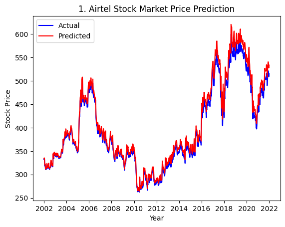
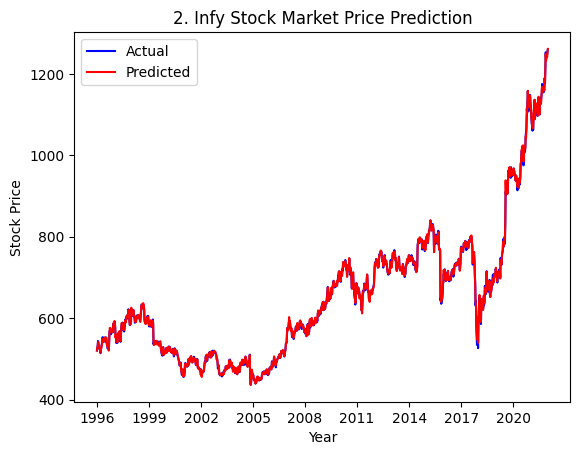
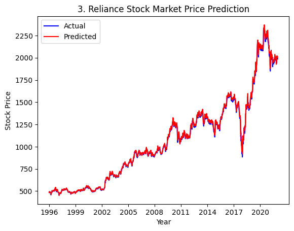
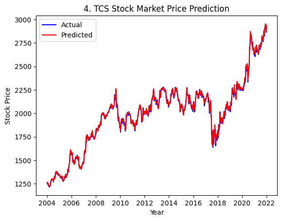

# 📈 Stock Market Price Predictor

This project is a **Linear Regression-based stock price predictor** for four major Indian companies: **Airtel, Infosys (Infy), Reliance, and TCS**.

It reads historical stock data, preprocesses it, trains individual models, and visualizes the **actual vs predicted closing prices** for each company.

---

## 🧠 Technologies Used

- **Python**
- **pandas** — for data manipulation  
- **NumPy** — for numerical operations  
- **matplotlib** — for plotting actual vs predicted prices  
- **scikit-learn** — for regression modeling and data scaling  

---

## 📁 Dataset Structure

Uses the **MovieLens 100k dataset** available at:
👉 [https://www.kaggle.com/datasets/jatta3399/historicalstockdata-jio-airtel-infosys-tcs](https://www.kaggle.com/datasets/jatta3399/historicalstockdata-jio-airtel-infosys-tcs)

Required files (place them in a `data/` folder):
- `airtel_df.csv` — contains historical stock data of airtel stocks
- `infy_df.csv` — contains historical stock data of infosys stocks
- `reliance_df.csv` — contains historical stock data of reliance stocks
- `tcs_df.csv` — contains historical stock data of tcs stocks

Each file should include at least the following columns:
- `Date` — Stock trading date  
- `Close` — Closing price of the stock  
- `Open`, `High`, `Low`, `Volume`, `Adj Close` — Optional features used for modeling  

---

## 🚀 How It Works

1. **Loads CSV files** for each company  
2. **Parses dates** and creates new features: `Year`, `Month`, `Day`  
3. **Interpolates missing values**  
4. **Scales features** using `StandardScaler`  
5. **Splits data** into training and test sets (80/20)  
6. **Trains a Linear Regression model** for each company  
7. **Predicts future prices** using the test set  
8. **Plots Actual vs Predicted** prices using `matplotlib`  

---

## 📊 Visualization Output

- A 2x2 grid of subplots
- Each subplot shows actual and predicted prices for a company
- X-axis: Year (approximated from test split size)
- Y-axis: Stock closing price

### Example Subplot Titles:
- `1. Airtel Stock Market Price Prediction`
- `2. Infy Stock Market Price Prediction`
- `3. Reliance Stock Market Price Prediction`
- `4. TCS Stock Market Price Prediction`

---

## 🔧 Installation

```bash
git clone https://github.com/your-username/stock-price-predictor.git
cd stock-price-predictor
pip install -r requirements.txt
```

## 🖼️ Output - Actual VS Predicted Data

### 🔹 Airtel Stock Graph


### 🔹 Infosys Stock Graph


### 🔹 Reliance Stock Graph


### 🔹 TCS Stock Graph
